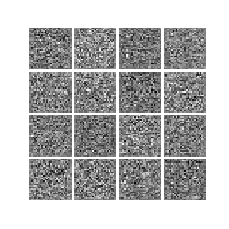

# CSE 455 Computer Vision Final Project

## Demo

| Vanilla GAN | Deep Convolutional GAN |
| ----------- | ---------------------- |
|  |  |

## References

* I. Goodfellow, J. Pouget-Abdie, M.Mirza, B. Xu, D. Warde-Farley, S.Ozair, A. Courville, and Y. Bengio,
    ["Generative Adversarial Nets"](https://arxiv.org/abs/1406.2661), in _NIPS_, 2014, pp.2672-2680.
* A. Radford, L. Metz, and S. Chintala, ["Unsupervised Representation Learning with
    Deep Convolutional Generative Adversarial Networks"](https://arxiv.org/abs/1511.06434), in _ICLR_, 2016.
* X. Chen, Y. Duan, R. Houthooft, J. Schulman, I. Sutskever, and P. Abbeel. ["Infogan: Interpretable
    representation learning by information maximizing generative adversarial nets"](https://arxiv.org/abs/1606.03657), in _NIPS_, 2016.